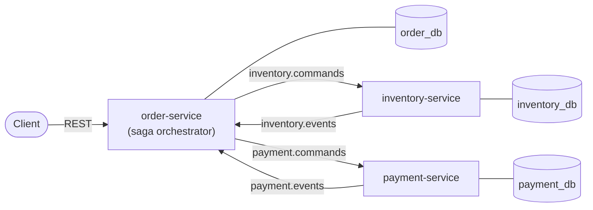
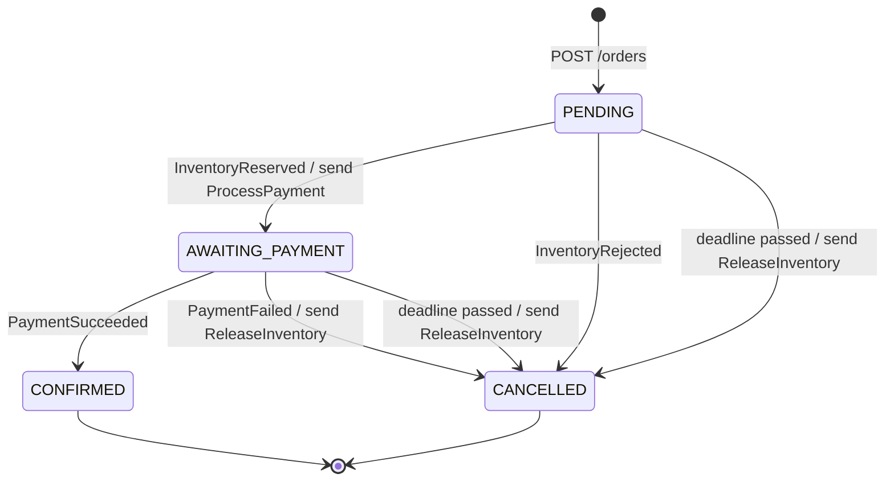
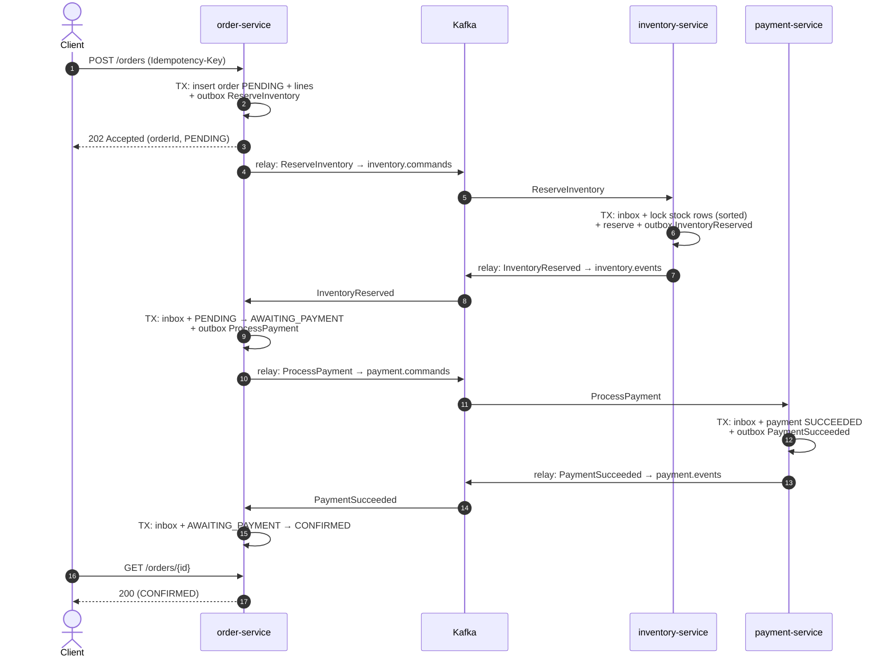
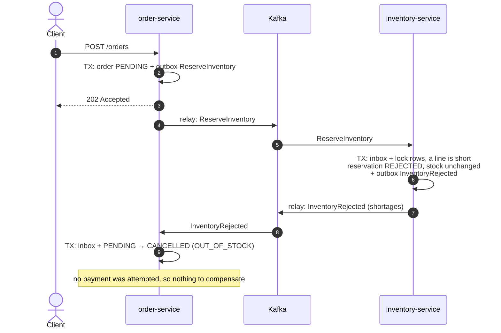
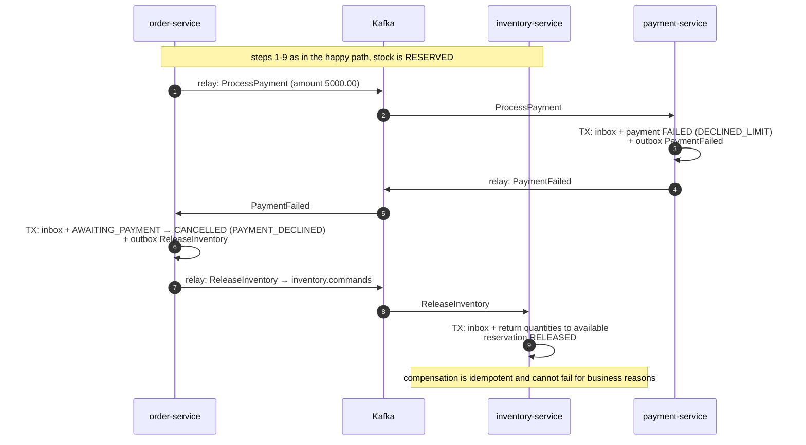
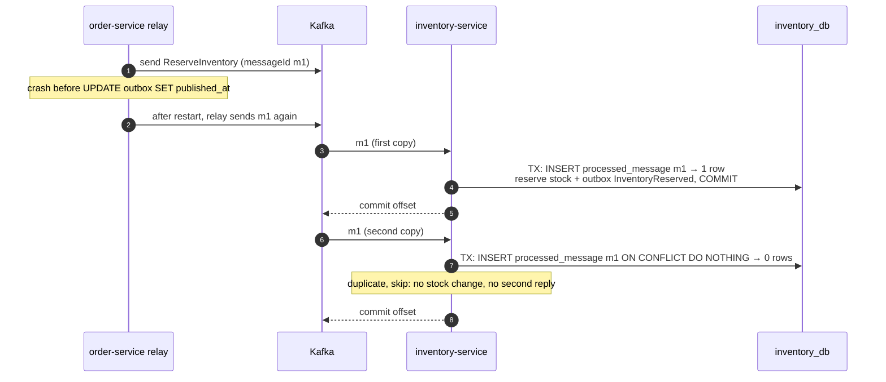
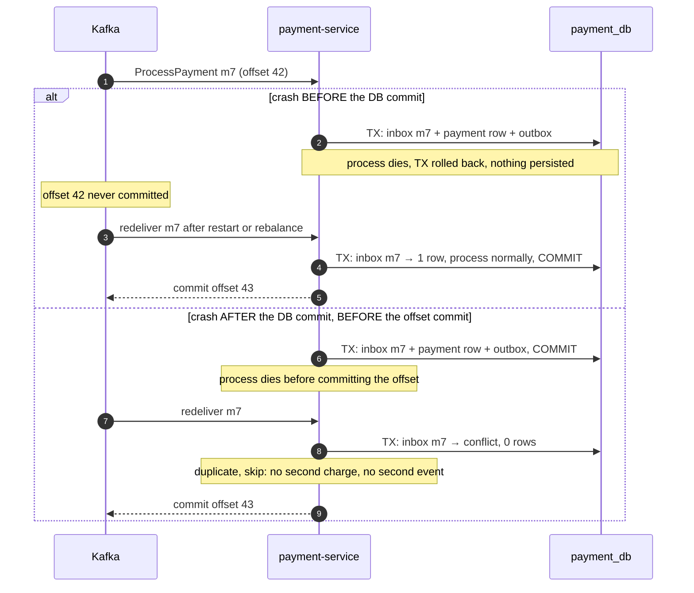
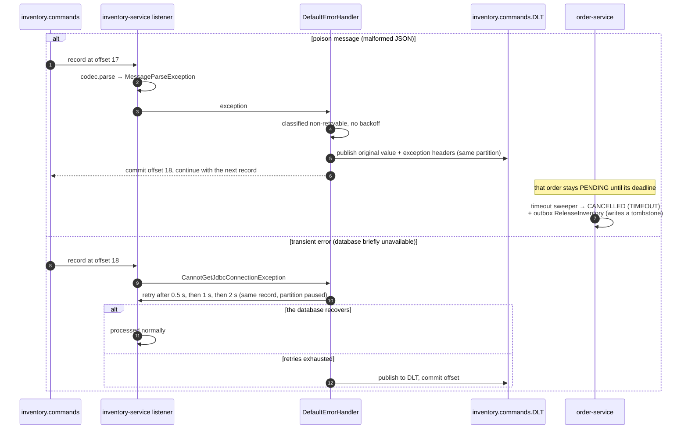
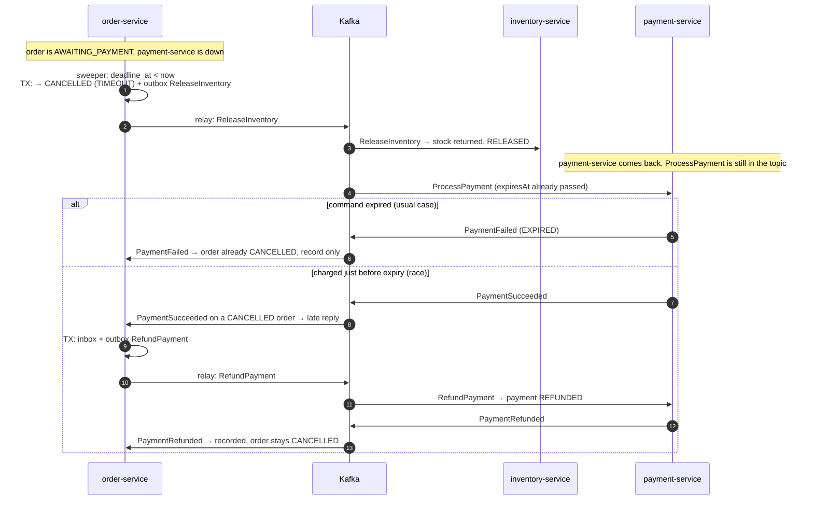

# orderflow: Architecture

An event-driven order and payments platform. It is built to show distributed-systems patterns: the saga pattern (orchestrated), the transactional outbox, idempotent consumers, retry with a dead-letter topic, and tests for the failure cases.

> Status: **design, not yet implemented.** Each decision links to an ADR in [`adr/`](adr/), where you'll find the options that were considered and the strongest argument against the choice.

---

## 1. Goals and non-goals

**Goals**
- Placing an order is a multi-service business transaction that ends in exactly one terminal state: `CONFIRMED`, or `CANCELLED` with all side effects compensated.
- No message is lost between a database commit and Kafka (outbox).
- Processing a message twice has the same effect as processing it once (idempotent consumers).
- A message that can never succeed does not block its partition forever (DLT). An order whose saga stalls is still brought to a terminal state (saga timeout).
- Every failure path is covered by an automated test against real Postgres and Kafka (Testcontainers).

**Non-goals (for now)**
- Kubernetes, authentication, a UI, a product catalog or pricing, and shipping/fulfillment.
- Tracing is a stretch goal.
- Talking to a real payment provider. Payment is a deterministic simulator.

---

## 2. Services and ownership



| Service | Owns | Responsibilities |
|---|---|---|
| **order-service** (port 8081) | `order_db`: orders, order lines, saga state | REST API; runs the order saga: sends commands, reacts to replies, compensates, enforces deadlines, handles late replies |
| **inventory-service** (port 8082) | `inventory_db`: stock, reservations | Reserves the stock for all of an order's lines or none of them; releases reservations (compensation) |
| **payment-service** (port 8083) | `payment_db`: payments | Charges with a deterministic simulator; refunds (compensation for a late charge) |

Rules:
- Each service has **its own Postgres database**. No service reads another service's tables. Services communicate only through Kafka (plus the client-facing REST API on order-service).
- **Participants don't know about each other.** inventory-service has never heard of payments. Only the orchestrator knows the sequence of steps. See [ADR-0001](adr/0001-saga-orchestration-vs-choreography.md).
- A **command's schema is owned by the service that receives it.** For example, inventory-service defines `ReserveInventory`. An **event's schema is owned by the service that publishes it.**

---

## 3. The order saga

### 3.1 Step order (why payment comes after inventory)

| # | Step | Owner | Kind | Compensation |
|---|---|---|---|---|
| 1 | Create order (`PENDING`) | order | local transaction | Cancel order |
| 2 | Reserve inventory (all lines or none) | inventory | **compensatable** | `ReleaseInventory` |
| 3 | Charge payment | payment | **pivot** (point of no return) | `RefundPayment`, used only for late or timed-out cases |
| 4 | Confirm order | order | **retriable** (cannot fail for business reasons) | none |

Steps that can be compensated go **before** the pivot. Steps after the pivot must always eventually succeed. Reserving first means we never charge for stock we can't supply, so the normal failure path never needs a refund.

### 3.2 Order state machine

The state lives on the `orders` row (`status`, `deadline_at`, `version`).



### 3.3 Reply handling table (the orchestrator's complete rule set)

Every `(current status, incoming message)` combination has a defined outcome. Combinations not listed are **ignored and logged at WARN**, and there are tests for them. The status update and the outbox insert of the next command happen in **one local transaction**.

| Current status | Incoming | Action (outbox) | New status | Reason |
|---|---|---|---|---|
| PENDING | InventoryReserved | ProcessPayment | AWAITING_PAYMENT | |
| PENDING | InventoryRejected | — | CANCELLED | `OUT_OF_STOCK` |
| AWAITING_PAYMENT | PaymentSucceeded | — | CONFIRMED | |
| AWAITING_PAYMENT | PaymentFailed | ReleaseInventory | CANCELLED | `PAYMENT_DECLINED` |
| PENDING / AWAITING_PAYMENT | *(sweeper: `deadline_at < now`)* | ReleaseInventory | CANCELLED | `TIMEOUT` |
| CANCELLED | InventoryReserved *(late)* | ReleaseInventory | CANCELLED | late reply |
| CANCELLED | PaymentSucceeded *(late)* | RefundPayment | CANCELLED | late reply |
| CANCELLED | InventoryRejected, PaymentFailed, PaymentRefunded | — (record only) | CANCELLED | |
| CONFIRMED | anything | — (WARN) | CONFIRMED | |

**Concurrency.** The reply handler and the timeout sweeper can both act on the same order. Every status change is therefore an optimistic update: `UPDATE orders SET status = ?, version = version + 1 WHERE id = ? AND version = ?`.
- If no row is updated, the reply handler throws a *retryable* exception. The redelivered message is then evaluated against the new state.
- If no row is updated, the sweeper simply skips that order.

**Command expiry.** `ProcessPayment` carries `expiresAt`, which is set to the order's deadline. payment-service declines expired commands (`PaymentFailed(EXPIRED)`), so most late charges never happen. `RefundPayment` covers the remaining race, where a charge lands just before the deadline and its reply arrives after it. Clocks on different hosts can drift (clock skew), so expiry is only a best-effort guard. The refund path is what guarantees correctness.

---

## 4. Kafka topology

| Topic | Messages | Producer | Consumer group |
|---|---|---|---|
| `inventory.commands` | ReserveInventory, ReleaseInventory | order-service | `inventory-service` |
| `inventory.events` | InventoryReserved, InventoryRejected | inventory-service | `order-service` |
| `payment.commands` | ProcessPayment, RefundPayment | order-service | `payment-service` |
| `payment.events` | PaymentSucceeded, PaymentFailed, PaymentRefunded | payment-service | `order-service` |
| `<topic>.DLT` (one per consumed topic) | Records that failed processing, with exception headers | the consumer's error handler | none (inspected and replayed manually) |

- **Key = `orderId`** for every message. Kafka only guarantees ordering within a partition, so every message for the same order lands on the same partition and is consumed in order. This is why `ReleaseInventory` can never overtake `ReserveInventory` for the same order.
- **3 partitions** per topic. The DLT has the same partition count, so a failed record goes to the same partition number. Locally the replication factor is 1. In production it would be 3 with `min.insync.replicas=2`.
- `auto.create.topics.enable=false`. Each topic is declared in code as a `NewTopic` bean by the service that **produces** to it. Each DLT is declared by the service that **consumes** the source topic.
- Producers: `acks=all`, `enable.idempotence=true`. Consumers: `enable.auto.commit=false`, listener `AckMode.RECORD` (the offset is committed after each record has been processed and its DB transaction committed), and `auto.offset.reset=earliest`.
- Kafka serializers are plain `String` serializers. The JSON (de)serialization is done explicitly by a small codec in `platform-messaging`. There is no Java type information in headers. See [ADR-0005](adr/0005-event-schema-and-versioning.md).

Retry and dead-letter behaviour is covered in [ADR-0004](adr/0004-retry-and-dead-letter-strategy.md).

---

## 5. Message envelope and schemas

### 5.1 Envelope (every message)

```json
{
  "messageId": "7d3f1c2e-9a51-4b0e-8f0a-2a6a1f6f9c11",
  "messageType": "ReserveInventory",
  "schemaVersion": 1,
  "occurredAt": "2026-10-08T10:15:30.123Z",
  "correlationId": "b1e2…orderId",
  "causationId": "messageId of the message that caused this one (null for the first)",
  "producer": "order-service",
  "payload": { }
}
```

| Field | Purpose |
|---|---|
| `messageId` | UUID created when the row is inserted into the outbox. **The idempotency key for consumers.** Stays the same across re-sends and DLT replays. |
| `messageType` + `schemaVersion` | Decide how `payload` is decoded. An unknown type or unsupported version is non-retryable and goes to the DLT. |
| `correlationId` | Always the `orderId`. Put into the logging MDC so you can follow one saga across services. |
| `causationId` | Links each message to the one that caused it, for debugging and future tracing. |

Conventions:
- Money is a **decimal string** (`"12.50"`), never a JSON number, to avoid floating-point errors.
- Timestamps are ISO-8601 UTC.
- Enums are strings.
- Consumers ignore unknown fields (tolerant reader).

### 5.2 Payloads (v1)

Each payload is a Java `record`. Commands are named in the imperative, events in the past tense.

| Type | Payload |
|---|---|
| `ReserveInventory` | `{ orderId, lines: [ { sku, quantity } ] }` |
| `ReleaseInventory` | `{ orderId, reason: PAYMENT_DECLINED \| TIMEOUT \| LATE_RESERVATION }` |
| `InventoryReserved` | `{ orderId }` |
| `InventoryRejected` | `{ orderId, reason: OUT_OF_STOCK \| UNKNOWN_SKU \| ALREADY_RELEASED, shortages: [ { sku, requested, available } ] }` |
| `ProcessPayment` | `{ orderId, customerId, amount: "37.50", currency: "EUR", expiresAt }` |
| `RefundPayment` | `{ orderId, reason: LATE_PAYMENT }` |
| `PaymentSucceeded` | `{ orderId, paymentId, amount, currency }` |
| `PaymentFailed` | `{ orderId, reason: DECLINED_LIMIT \| DECLINED_BLOCKED_CUSTOMER \| EXPIRED }` |
| `PaymentRefunded` | `{ orderId, paymentId }` |

In code, these are grouped under sealed interfaces (`InventoryCommand`, `InventoryEvent`, `PaymentCommand`, `PaymentEvent`). Handlers dispatch with an exhaustive `switch`, so adding a new message type without handling it is a compile error.

---

## 6. Databases

Migrations are managed by Flyway in each service, under `db/migration/<service>`. Demo seed data lives under `db/seed/<service>` and is loaded only in the `local` profile.

### 6.1 Shared tables (in every service's database)

```sql
-- Transactional outbox (ADR-0002)
CREATE TABLE outbox (
    id            BIGINT GENERATED ALWAYS AS IDENTITY PRIMARY KEY, -- send order
    message_id    UUID        NOT NULL UNIQUE,
    topic         TEXT        NOT NULL,
    message_key   TEXT        NOT NULL,          -- orderId
    message_type  TEXT        NOT NULL,
    envelope      JSONB       NOT NULL,          -- full envelope as sent
    created_at    TIMESTAMPTZ NOT NULL DEFAULT now(),
    published_at  TIMESTAMPTZ                    -- NULL = not yet sent
);
CREATE INDEX outbox_unpublished_idx ON outbox (id) WHERE published_at IS NULL;

-- Inbox / processed-message tracking (ADR-0003)
CREATE TABLE processed_message (
    consumer      TEXT        NOT NULL,          -- handler name, e.g. 'inventory-commands'
    message_id    UUID        NOT NULL,
    processed_at  TIMESTAMPTZ NOT NULL DEFAULT now(),
    PRIMARY KEY (consumer, message_id)
);
```

### 6.2 order_db

```sql
CREATE TABLE orders (
    id               UUID PRIMARY KEY,
    customer_id      UUID          NOT NULL,
    status           TEXT          NOT NULL CHECK (status IN ('PENDING','AWAITING_PAYMENT','CONFIRMED','CANCELLED')),
    cancel_reason    TEXT,
    total_amount     NUMERIC(19,2) NOT NULL CHECK (total_amount > 0),
    currency         CHAR(3)       NOT NULL,
    idempotency_key  TEXT          NOT NULL,
    request_hash     TEXT          NOT NULL,     -- detects the same key reused with a different body
    deadline_at      TIMESTAMPTZ   NOT NULL,
    created_at       TIMESTAMPTZ   NOT NULL DEFAULT now(),
    updated_at       TIMESTAMPTZ   NOT NULL DEFAULT now(),
    version          BIGINT        NOT NULL DEFAULT 0,
    UNIQUE (customer_id, idempotency_key)
);
CREATE INDEX orders_open_deadline_idx ON orders (deadline_at)
    WHERE status IN ('PENDING','AWAITING_PAYMENT');

CREATE TABLE order_lines (
    order_id    UUID          NOT NULL REFERENCES orders(id),
    line_no     INT           NOT NULL,
    sku         TEXT          NOT NULL,
    quantity    INT           NOT NULL CHECK (quantity > 0),
    unit_price  NUMERIC(19,2) NOT NULL CHECK (unit_price >= 0),
    PRIMARY KEY (order_id, line_no)
);
```

### 6.3 inventory_db

```sql
CREATE TABLE product_stock (
    sku         TEXT PRIMARY KEY,
    available   INT NOT NULL CHECK (available >= 0),   -- the CHECK is a safety net; the app validates first
    reserved    INT NOT NULL CHECK (reserved  >= 0),
    updated_at  TIMESTAMPTZ NOT NULL DEFAULT now()
);

CREATE TABLE reservation (
    order_id    UUID PRIMARY KEY,                      -- natural idempotency: one reservation per order
    status      TEXT NOT NULL CHECK (status IN ('RESERVED','REJECTED','RELEASED')),
    created_at  TIMESTAMPTZ NOT NULL DEFAULT now(),
    updated_at  TIMESTAMPTZ NOT NULL DEFAULT now()
);

CREATE TABLE reservation_line (
    order_id  UUID NOT NULL REFERENCES reservation(order_id),
    sku       TEXT NOT NULL REFERENCES product_stock(sku),
    quantity  INT  NOT NULL CHECK (quantity > 0),
    PRIMARY KEY (order_id, sku)
);
```

**Reserve algorithm** (one transaction):
1. If a `reservation` row already exists for the order, do nothing. This is natural idempotency, a second line of defence behind the inbox.
2. Merge duplicate SKUs and sort them. `SELECT … FROM product_stock WHERE sku IN (…) ORDER BY sku FOR UPDATE`. Locking rows in a **consistent order prevents deadlocks** between concurrent orders that share SKUs.
3. Check every line against `available`.
   - All lines have enough stock: decrement `available`, increment `reserved`, insert `reservation(RESERVED)` and the lines, and write `InventoryReserved` to the outbox.
   - Any line is short: insert `reservation(REJECTED)` and write `InventoryRejected` (with the shortages) to the outbox. Stock is unchanged.

**Release algorithm:**
- `RESERVED`: add the quantities back and set the status to `RELEASED`.
- No row: insert a `RELEASED` **tombstone**, so that a later `ReserveInventory` for this order (for example a replay from the DLT) is a no-op.
- `REJECTED` / `RELEASED`: do nothing.

Releasing is a compensation, so it must never fail for business reasons. It can only fail for technical ones, which are retried.

Release locks the `reservation` row first (`FOR UPDATE`), then the stock rows in the same SKU order as reserve, so it can't deadlock with a reservation for another order. If a reserve for the same order commits between the release's "no row" check and its tombstone insert, the insert fails on the primary key; the retried release then finds `RESERVED` and returns the stock. (Both commands share the order's partition, so this only happens around a rebalance.)

### 6.4 payment_db

```sql
CREATE TABLE payment (
    id              UUID PRIMARY KEY,
    order_id        UUID          NOT NULL UNIQUE,     -- at most one charge per order
    customer_id     UUID          NOT NULL,
    amount          NUMERIC(19,2) NOT NULL,
    currency        CHAR(3)       NOT NULL,
    status          TEXT          NOT NULL CHECK (status IN ('SUCCEEDED','FAILED','REFUNDED')),
    failure_reason  TEXT,
    created_at      TIMESTAMPTZ   NOT NULL DEFAULT now(),
    updated_at      TIMESTAMPTZ   NOT NULL DEFAULT now()
);
```

**Simulator rules** (configured under `orderflow.payment.*`), checked in this order:
1. `expiresAt` has passed → `FAILED(EXPIRED)`.
2. The customer is in `blocked-customers` → `FAILED(DECLINED_BLOCKED_CUSTOMER)`.
3. `amount > decline-above` (default `1000.00`) → `FAILED(DECLINED_LIMIT)`.
4. `amount == transient-failure-amount` (default `13.13`) → throw `TransientPaymentException` on the first *N* attempts for that order (tracked in memory; it's only a simulator). This lets you demo retries.
5. Otherwise → `SUCCEEDED`.

---

## 7. Reliability mechanics

### 7.1 Producing: transactional outbox (ADR-0002)

Business change and `INSERT INTO outbox` happen in **one local DB transaction**. A relay running every 200 ms in the same service then publishes the rows:

```
BEGIN;
SELECT pg_try_advisory_xact_lock(<relay-lock-id>);      -- false → another instance is relaying; exit
SELECT * FROM outbox WHERE published_at IS NULL ORDER BY id LIMIT 100;
  for each row: kafkaTemplate.send(topic, key, envelope).get(5s)   -- synchronous; stop at first failure
                UPDATE outbox SET published_at = now() WHERE id = ?
COMMIT;
```

- Delivery is at-least-once. If the service crashes after sending but before `COMMIT`, the row is sent again on the next run. Consumers handle that.
- A **failed send** (Kafka down, timeout) stops the batch at that row so nothing overtakes it. Rows already sent in that batch stay marked; they are not re-sent.
- The relay runs on its **own single background thread** (`OutboxRelayScheduler`, a `SmartLifecycle`), not on `@Scheduled`, so the library doesn't switch on scheduling for the whole application. It starts after Kafka and stops before it. When a batch comes back full it runs again immediately, so a burst doesn't wait one poll interval per batch.
- Tests set `orderflow.outbox.relay-enabled=false` and call `OutboxRelay.publishBatch()` directly, so every step is deterministic. Crash points (`OutboxRelay.BEFORE_SEND`, `AFTER_SEND`, `OutboxWriter.AFTER_WRITE`) are triggered through the `FaultInjector`.
- There is no "last published id" high-water mark. Identity values are assigned at *insert* time, not commit time, so a transaction holding `id = 10` can commit after `id = 11` has already been published. A high-water mark would skip it forever. The `published_at IS NULL` flag never skips anything.
- An hourly cleanup job (`MessagingCleanup`, own background thread like the relay) deletes published rows older than 7 days and `processed_message` rows older than 14 days, in batches of 1 000 that each commit on their own. Unpublished rows are never deleted, however old. The inbox is kept longer than the outbox because a producer can only re-send a message while its outbox row exists; a DLT replay after both are gone is caught by the natural keys. Settings: `orderflow.cleanup.*`.
- A gauge `outbox.pending` and a gauge for the age of the oldest unpublished row are exposed through Actuator (`/actuator/metrics`), next to the `messaging.duplicates.skipped` and `messaging.dlt.published` counters.

### 7.2 Consuming: idempotent handler (ADR-0003)

```
listener(record):
    envelope = codec.parse(record.value())               -- failure → non-retryable → DLT
    MDC.put(orderId, messageId)
    @Transactional {
        rows = INSERT INTO processed_message(consumer, message_id) VALUES (?, ?) ON CONFLICT DO NOTHING
        if rows == 0 → log "duplicate", return            -- already processed
        handler.handle(envelope)                          -- business change + outbox inserts
    }                                                     -- DB COMMIT
    → container commits offset (AckMode.RECORD)
```

The inbox row is inserted **first** on purpose. If two consumers race on the same message (for example during a rebalance), the second blocks on the unique index until the first commits, and then sees the conflict. `IdempotentMessageHandlerIT` proves this by holding the first transaction open until Postgres reports the second session waiting on a lock.

Crash points for tests: `IdempotentMessageHandler.BEFORE_COMMIT` (everything rolls back, the redelivery processes the message) and `AFTER_COMMIT` (committed but the offset isn't, so the redelivery is skipped as a duplicate). With `AckMode.RECORD` nothing runs between the listener returning and the offset commit, so `AFTER_COMMIT` also covers "crash before the offset commit".

Business handlers declare `@Transactional(propagation = MANDATORY)`: they can only run inside the inbox transaction, so the reply in the outbox, the state change and the inbox row always commit together. Each skipped duplicate increments `messaging.duplicates.skipped{consumer=…}`.

### 7.3 Retries and DLT (ADR-0004)

- **Blocking retries.** `DefaultErrorHandler` with `ExponentialBackOff`: 500 ms, ×2, at most 3 retries (about 3.5 s in total).
- **Non-retryable** (straight to the DLT, no backoff): `MessageParseException` (malformed JSON, unknown type, unsupported version) and `NonRetryableMessageException` (payload fails validation).
- **Retryable:** everything else, for example `TransientDataAccessException`, optimistic-lock conflicts and `TransientPaymentException`.
- `DeadLetterPublishingRecoverer` sends the record to `<topic>.DLT` on the same partition, with headers holding the original topic, partition and offset plus the exception class and message.
- An order whose command is parked in the DLT is still brought to a terminal state by the **saga timeout** (§3.3).
- Replaying from the DLT is safe because `messageId` is kept and consumers are idempotent.
- One `CommonErrorHandler` bean from `platform-messaging` (`DeadLetterErrorHandler`), which Spring Boot applies to every listener. The budget is configurable under `orderflow.consumer.retry.*`. Each dead-lettered record increments `messaging.dlt.published{topic=…}` and is logged at ERROR.

### 7.4 Saga timeout

`OrderTimeoutSweeper` runs every 5 s:
- It selects orders with `status IN (PENDING, AWAITING_PAYMENT) AND deadline_at < now()`, oldest deadline first, at most 50 at a time.
- For each one, in its own transaction, it applies the `TIMEOUT` transition from §3.3 (`CANCELLED` + `ReleaseInventory`) with the optimistic update.
- If a reply changed the order in between, the version check fails and the sweeper skips it. The next run re-evaluates it from its new state. If the sweeper commits first, the reply handler's update fails instead, and the retried reply takes the late-reply row of §3.3.

The deadline defaults to `PT30S` (`orderflow.saga.timeout`); the schedule is `orderflow.saga.sweep-interval` and `sweep-batch-size`. ITs switch the schedule off (`orderflow.saga.sweeper-enabled=false`), move an order's deadline into the past and call `sweep()` themselves; `OrderTimeoutScheduleIT` runs the real schedule with a 2 s timeout.

### 7.5 Threads

`spring.threads.virtual.enabled=true`. Tomcat request handling, `@Scheduled` tasks and Kafka listener containers then run on virtual threads.
- Virtual threads make blocking JDBC calls cheap, but **database concurrency is still capped by the HikariCP pool size**. Virtual threads don't create database connections. Each service sets `maximum-pool-size: 10` explicitly: enough for 3 listener threads, the relay, the sweeper and request bursts. Extra threads wait for a connection instead of overloading Postgres, and in inventory a bigger pool would mostly mean more transactions queuing on the same stock-row locks.
- The outbox relay and the cleanup job keep their own single platform thread (they are long-lived loops, not request work).
- Since JDK 24 (JEP 491), `synchronized` blocks no longer pin the carrier thread, which removes the classic virtual-thread pitfall with older JDBC drivers.

---

## 8. Sequence diagrams

In these diagrams, "relay" means the outbox relay inside the named service, which publishes rows that were committed in an earlier transaction.

### 8.1 Happy path



### 8.2 Failure: out of stock



### 8.3 Failure: payment declined (compensation)



### 8.4 Failure: duplicate delivery



### 8.5 Failure: consumer crash mid-processing



### 8.6 Failure: poison message and transient error



### 8.7 Failure: saga timeout and late reply (refund)



---

## 9. REST API

| Method and path | Service | Purpose |
|---|---|---|
| `POST /orders` | order | Create an order. Requires the `Idempotency-Key` header. |
| `GET /orders/{id}` | order | Order status, cancel reason, lines and totals |
| `GET /stock/{sku}` | inventory | `available` / `reserved` (for demos and tests) |
| `GET /payments?orderId=` | payment | Payment record (for demos and tests) |

```http
POST /orders
Idempotency-Key: 4f9b8c1a-…
Content-Type: application/json

{ "customerId": "…", "currency": "EUR",
  "lines": [ { "sku": "MUG-RED", "quantity": 2, "unitPrice": "12.50" } ] }
```

| Situation | Response |
|---|---|
| New order | `202 Accepted`, `Location: /orders/{id}`, body `{ orderId, status: "PENDING" }` |
| Same key, same body | `202` with the **same** `orderId` and `Idempotent-Replayed: true` (a safe client retry). "Same" is compared on the normalised request, so `"12.5"` and `"12.50"` match. |
| Same key, different body | `422 Unprocessable Entity` |
| Missing key or invalid body | `400`, as an RFC 9457 `ProblemDetail` |

Prices come from the client because there is no catalog in scope. This is a known simplification (§10).

**Validation** lives in the domain (`OrderDraft.of`), not in Bean Validation annotations: one place for the rules, plain Java, no extra dependency. It reports every violation in one `errors` list.

**Concurrent retries with the same key** are resolved by the `UNIQUE (customer_id, idempotency_key)` index. The losing insert fails, and because Postgres aborts a transaction after a constraint violation, the loser re-reads the winner's order *outside* that transaction and replays it.

---

## 10. Known limitations (deliberate)

- **Prices are trusted from the client.** A real system would price the order from a catalog service.
- **Confirmed reservations are never "shipped".** `reserved` only grows, because fulfillment is out of scope.
- **One relay instance per service** is enforced by an advisory lock. Scaling out would mean partitioning the relay by key hash. See ADR-0002.
- **Payment is a simulator.** A real payment provider brings the "unknown outcome" problem (timeout after the charge). Solving it needs an idempotency key sent to the provider plus a status query. That is not covered here.
- **The DLT has no automated consumer.** Records are inspected in kafka-ui and replayed manually.
- **Local Kafka has replication factor 1.** Production values are listed in §4.
